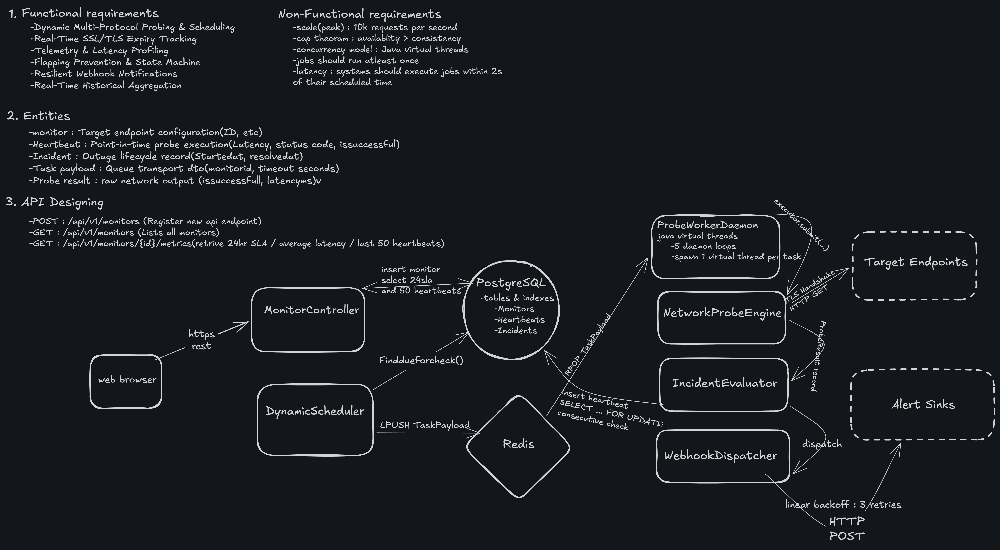

# ⚡ PulseWatch

> Distributed, high-throughput website uptime and SSL certificate monitoring engine built with **Java 21 Virtual Threads**, **Spring Boot 3**, **Redis**, and **PostgreSQL**.

[](https://pulsewatch-api-w2qi.onrender.com/)
[](https://openjdk.org/projects/jdk/21/)
[](https://spring.io/projects/spring-boot)
[](https://www.postgresql.org/)
[](https://redis.io/)

---

## 🎯 Overview

PulseWatch is an automated API telemetry and uptime monitoring system engineered for high concurrency and sub-second dispatching. Designed to eliminate thread-pool starvation typical of I/O-heavy polling architectures, PulseWatch pairs Java 21 Virtual Threads with an asynchronous Redis task queue to handle continuous non-blocking health checks, leaf SSL certificate expiration analysis, and automated incident alerting.

🔗 **Live Deployment:** [pulsewatch-api-w2qi.onrender.com](https://pulsewatch-api-w2qi.onrender.com/)

---

## 📋 System Design Specifications

<p align="center">
  
</p>

### 1. Functional Requirements
* **Dynamic Multi-Protocol Probing & Scheduling:** Automated dispatching of HTTP/HTTPS health checks at user-defined intervals.
* **Real-Time SSL/TLS Expiry Tracking:** Inspects peer TLS certificates during the handshake to track days remaining until certificate expiration.
* **Telemetry & Latency Profiling:** Records status codes, round-trip latency, and failure logs per heartbeat.
* **Flapping Prevention & State Machine:** Avoids alert flapping through threshold-based failure detection before flipping state[cite: 1, 7].
* **Resilient Webhook Notifications:** Dispatches incident and recovery payloads with automated retries and linear backoff[cite: 1, 7].
* **Real-Time Historical Aggregation:** Calculates rolling 24-hour SLA uptime percentages and average latency on demand[cite: 1, 7].

### 2. Non-Functional Requirements
* **Scale Target:** Designed to support a peak capacity of up to 10,000 requests per second[cite: 7].
* **CAP Theorem Trade-Off:** **Availability > Consistency** (AP biased) — health probes must execute continuously without blocking, tolerating eventual metric updates[cite: 7].
* **Concurrency Model:** Java Virtual Threads (Project Loom) for lightweight, unbound I/O blocking[cite: 1, 7].
* **Delivery Semantics:** At-least-once probe execution guarantee[cite: 7].
* **Execution Latency:** Systems must execute due probe tasks within 2 seconds of their scheduled time[cite: 7].

---

## 🗄️ Domain Entities

| Entity / DTO | Purpose | Key Attributes |
| :--- | :--- | :--- |
| **`Monitor`**[cite: 1, 7] | Target endpoint configuration and current health state[cite: 7]. | `id`, `name`, `url`, `intervalSeconds`, `timeoutSeconds`, `expectedStatusCode`, `status`, `consecutiveFailures`[cite: 1, 7] |
| **`Heartbeat`**[cite: 1, 7] | Point-in-time probe execution telemetry record[cite: 7]. | `id`, `monitorId`, `statusCode`, `latencyMs`, `isSuccessful`, `sslDaysRemaining`, `errorMessage`, `createdAt`[cite: 1, 7] |
| **`Incident`**[cite: 1, 7] | Outage lifecycle record tracking downtime duration[cite: 7]. | `id`, `monitorId`, `startedAt`, `resolvedAt`, `cause`[cite: 1, 7] |
| **`TaskPayload`**[cite: 1, 7] | Queue transport DTO passed over Redis[cite: 7]. | `monitorId`, `targetUrl`, `timeoutSeconds`, `expectedStatusCode`[cite: 1, 7] |
| **`ProbeResult`**[cite: 1, 7] | Raw network output produced by the probe engine[cite: 7]. | `statusCode`, `latencyMs`, `isSuccessful`, `sslDaysRemaining`, `errorMessage`[cite: 1, 7] |

---

## 🏗️ System Architecture & Data Flow

```mermaid
flowchart TD
    Browser[Web Browser] -->|HTTPS / REST| MC[MonitorController]
    MC -->|Insert Monitor / Query 24h SLA & 50 Heartbeats| PG[(PostgreSQL\nTables & Indexes:\n- Monitors\n- Heartbeats\n- Incidents)]
    
    DS[DynamicScheduler] -->|findDueForCheck| PG
    DS -->|LPUSH TaskPayload| Redis[(Redis Queue)]
    
    Redis -->|RPOP / BRPOP TaskPayload| PWD[ProbeWorkerDaemon\n- Java Virtual Threads\n- Daemon loops\n- Spawns 1 VT per task]
    
    PWD -->|executor.submit| NPE[NetworkProbeEngine]
    NPE -->|TLS Handshake & HTTP GET| Target[Target Endpoints]
    NPE -->|ProbeResult Record| IE[IncidentEvaluator]
    
    IE -->|Insert Heartbeat\nSELECT ... FOR UPDATE\nConsecutive failure check| PG
    IE -->|dispatch| WD[WebhookDispatcher]
    WD -->|Linear Backoff: 3 retries\nHTTP POST| Alerts[Alert Sinks\nDiscord / Slack]